Advance Programming
# Module 11 - Deployment on Kubernetes 📘

- Nama    : Akhyar Rasyid Asy syifa
- Kelas   : Advance Programming - A
- NPM     : 2306241682

## Reflection 1: Hello Minikube
### 1. Compare the application logs before and after you exposed it as a Service. Try to open the app several times while the proxy into the Service is running. What do you see in the logs? Does the number of logs increase each time you open the app?

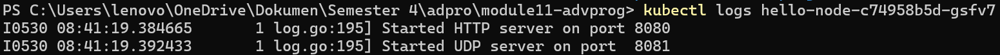
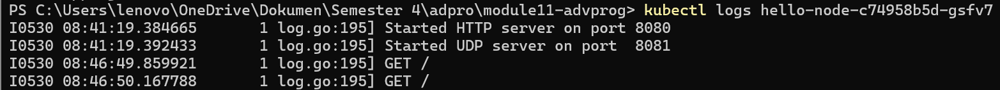
.png)

Dapat dilihat bahwa terdapat perbedaan pada ketiga gambar tersebut. Gambar pertama menunjukkan keadaan log ketika belum meng-exposed sebagai service. Bisa dilihat bahwa sebelum aplikasi diekspos tsb, hanya terlihat adanya HTTP dan UDP yang dijalankan pada port 8080 (HTTP) dan port 8081 (UDP) saja. Sedangkan gambar kedua menunjukkan keadaan log ketika sudah meng-exposed sebagai service, lalu gambar ketiga juga sama menunjukkan keadaan log ketika sudah meng-exposed sebagai service tapi itu log ketika berkunjung untuk ke-2 kalinya. Log tersebut berisi aktivitas yang terjadi dari aplikasi yang berjalan di container, yaitu adanya server HTTP yang telah dimulai pada port tertentu dan diterimanya permintaan GET pada endpoint "/" beberapa kali. Jumlah log juga akan terus bertambah seiring banyaknya kita mencoba mengakses aplikasi tersebut. Hal tersebut dapat dilihat dari log permintaan GET yang terus bertambah.

### 2. Notice that there are two versions of `kubectl get` invocation during this tutorial section. The first does not have any option, while the latter has `-n` option with value set to `kube-system`.What is the purpose of the `-n` option and why did the output not list the pods/services that you explicitly created?

Berdasarkan referensi dari [Namespace in Kubernetes
documentation](https://kubernetes.io/docs/concepts/overview/working-with-objects/namespaces/), penggunaan `-n` berfungsi untuk menspesifikasikan namespace yang akan dijadikan target. 

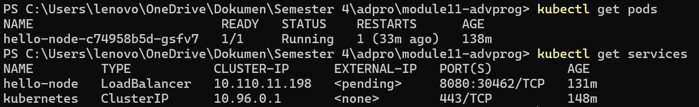

Pada versi yang pertama (tanpa `-n`), perintah tersebut akan mengembalikan pods dan services dari namespace default yang ada di kluster Kubernetes,

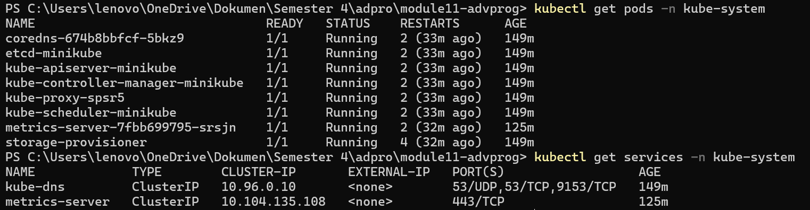
sedangkan versi yang kedua ini dia (dengan `-n`) akan mengembalikan pods dan services dari namespace yang telah dispesifikasikan (dalam kasus ini "kube-system") saja. Misalnya,`kubectl get pods -n kube-system` akan mengembalikan pods yang ada di namespace kube-system.


## Reflections on 'Rolling Update & Kubernetes Manifest File'Add commentMore actions

### 1. What is the difference between Rolling Update and Recreate deployment strategy?
Rolling update merupakan sstrategi default deployment. Cara kerjanya adalah dengan tidak langsung meng-*update* pods semuanya secara bersamaan, tetapi meng-*update* pods satu-satu atau beberapa terlebih dahulu sehingga pods yang lama masih masih tetap berjalan dan menjaga agar aplikasi tetap berjalan. Intinya ngubah aplikasi secara perlahan ke versi terbarunya.

Di sisi lain, kalau strategi recreate deployment akan ada downtime antara pembaruan aplikasi karena strategi ini memerlukan penghapusan aplikasi sebelumnya terlebih dahulu, baru setelah itu dia bakal mendistribusikan dan menciptakan ulang pods nya yang baru. 

### 2. Try deploying the Spring Petclinic REST using Recreate deployment strategy and document your attempt.
* Membuat spring-petclinic-rest baru dengan versi 3.0.2, melakukan expose dan scale
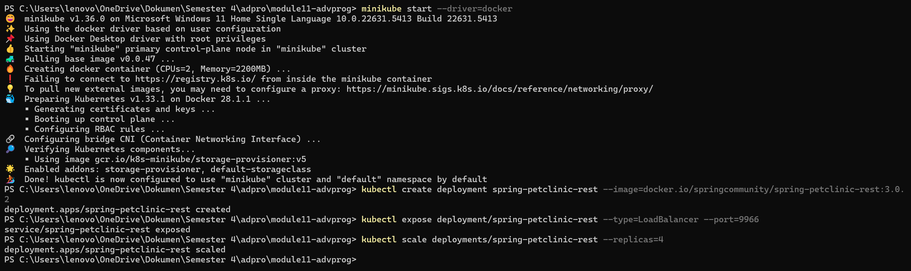

* Mengubah yaml untuk mengganti strategi deployment menjadi Recreate
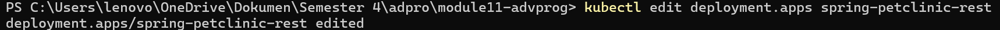
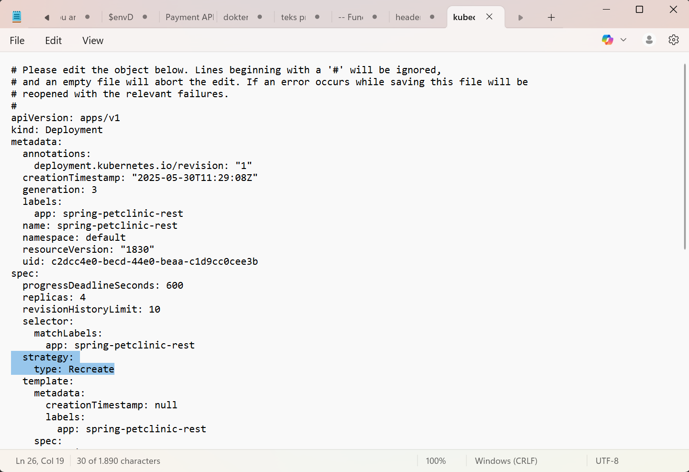

* Hasil pengubahan
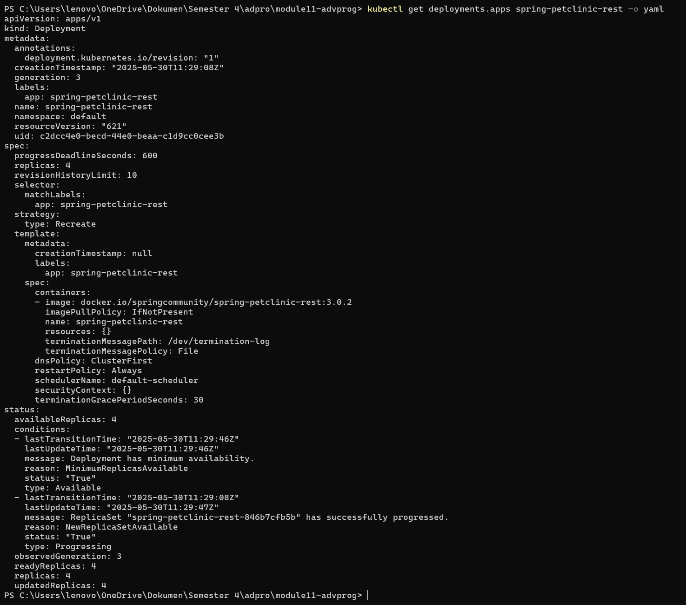

* Cek pods sementara dan hapus pods yang ada
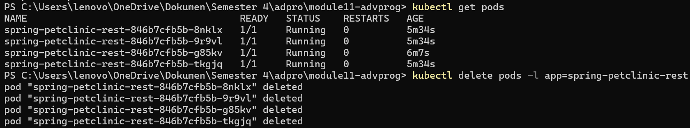
Dapat dilihat bahwa pods baru langsung dibuat setelah pods yang sebelumnya dihapus.

* Lihat pembaruan pods
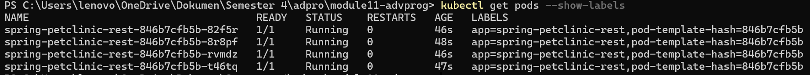
Dapat dilihat bahwa pod-pod baru sedang dibuat untuk menggatikan pod yang dihapus sebelumnya

* Mencoba menjalankan dan mengakses service
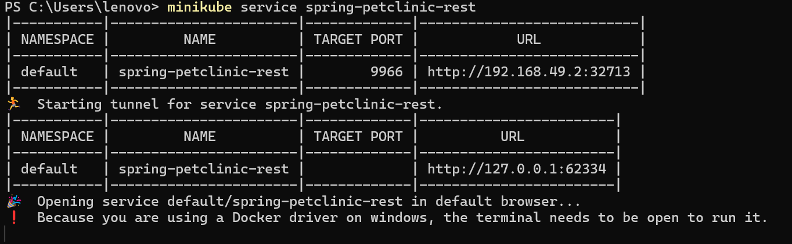

* Service berhasil di akses
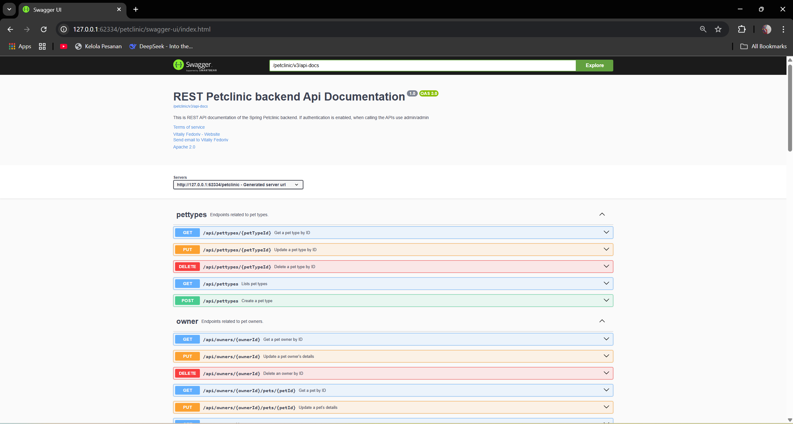

### 3. Prepare different manifest files for executing Recreate deployment strategy.
impor file yml yang baru saja dibuat untuk executing recreate deployment
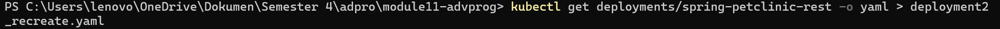

isinya kurang lebih terdapat pada file `deployment2_recreate.yml`, tapi saya ingin menyebut intinya saja.
sebelumnya (`deployment.yml`):
```yaml
  strategy:
    rollingUpdate:
      maxSurge: 25%
      maxUnavailable: 25%
    type: RollingUpdate
```
perbedaannya dengan `deployment2_recreate.yml` yang pernah dibuat sebelumnya adalah
```yaml
    strategy:
        type: Recreate
```

### 4. What do you think are the benefits of using Kubernetes manifest files? Recall your experience in deploying the app manually and compare it to your experience when deploying the same app by applying the manifest files (i.e., invoking `kubectl apply -f` command) to the cluster.

Alasan utamanya menurut saya untuk menangani masalah efektifitas dan efisiensi. Menggunakan Kubernetes manifest files memungkinkan adanya `declarative configuration` yang berarti bahwa state aplikasi kita dapat disimpan dalam format yang terstruktur, seperti yaml. Dengan adanya format yang terstruktur itu, maka akan terjaga konsistensi state aplikasinya misal ketika kita mau menjalankan deployment di berbagai lingkungan (dev, production, staging) dengan menggunakan format yang sama. Selain itu, men-*deploy* menggunakan perintah `kubectl apply-f` memungkinkan terjadinya automasi pada CI/CD pipelines sehingga proses deployment dapat dilakukan secara otomatis.
